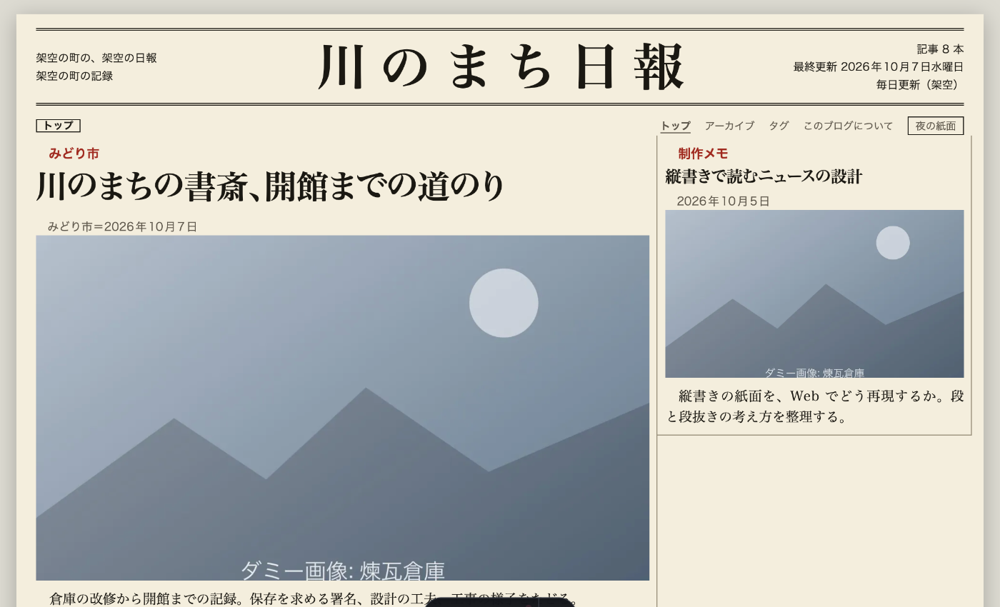
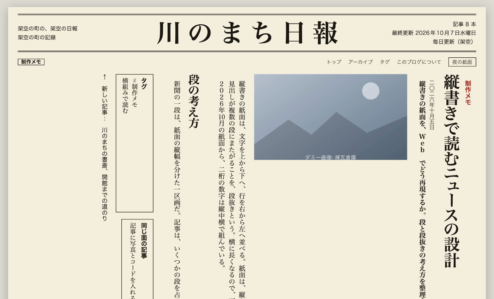

# astro-theme-shinbun

新聞の紙面のように書ける、日本語のブログの Astro テーマです。紙面の部品は [shinbun.css](https://github.com/kamimen/shinbun-css) を使っています。

    

日本語 | [English](README_en.md)





見本の内容（人物・団体・出来事・写真）は、すべて架空です。

## 特徴

### 紙面

ブログの名前が題字になり、最新の記事がトップ記事になります。タグは新聞の「面」にあたり、面ごとのページと一覧があります。既定は横組みで、記事ごとに縦組みを選べます。読む人は、記事ページで横組みと縦組みを切り替えられます。昼と夜の紙面も切り替えられ、選んだ紙面は次に開いたときも保たれます。

### 書く

記事は Markdown と MDX で書きます。frontmatter は、Astro のコンテンツコレクションで型を検査します。下書き（`draft: true`）と、公開日時が先の記事は公開しません。長い記事には、見出しの一覧（目次）が自動で付きます。コードのブロックは、昼と夜の紙面で色が切り替わります（Shiki）。記事の雛形は `npm run new-post` で作れます。

### 画像

Astro の画像最適化（WebP、`srcset`、遅延読み込み）に対応しています。トップ記事の写真、一覧のサムネイル、本文の画像（キャプションつき）、OG 画像に使えます。

### 公開

RSS、サイトマップ、robots.txt、canonical、Open Graph、構造化データ（JSON-LD）を出力します。ページ遷移（`ClientRouter`）とリンクの先読みもあります。公開する場所の基準パス（`site.base`）に対応するので、GitHub Pages のプロジェクトページでも使えます。設定は `shinbun.config.ts` の 1 ファイルです。

## プロジェクトの構成

```
/
├── public/
│   └── favicon.svg
├── scripts/
│   ├── new-post.ts             記事の雛形を作る
│   ├── update-theme.ts         このテーマの更新を取り込む
│   └── make-sample-images.ts   見本のダミー画像を作る
├── src/
│   ├── assets/photos/          見本の写真
│   ├── components/             題字、欄外、記事、ページ送りなど
│   ├── content/
│   │   ├── pages/about.md
│   │   └── posts/              記事（.md と .mdx）
│   ├── i18n/ja.ts              画面の文字列
│   ├── layouts/                Layout.astro
│   ├── pages/                  トップ、記事、タグ、アーカイブ、about、404、RSS
│   ├── plugins/rehype-figure.ts  本文の画像を写真（figure）にする
│   ├── scripts/                昼夜の切り替え、縦組み・横組みの切り替え
│   ├── styles/blog.css         shinbun.css の上に重ねるブログ向けの調整
│   ├── utils/                  記事の絞り込み、並べ替え、日付など
│   ├── config.ts               既定値を補った設定
│   └── content.config.ts       記事の frontmatter の型
├── test/                       単体テスト
├── vendor/                     shinbun.css（CSS と JavaScript）
├── astro.config.ts
└── shinbun.config.ts           利用者が直す設定
```

記事は、`src/content/posts/` に置きます。

## はじめ方

1. このリポジトリを、GitHub のテンプレートとして使うか、fork します。次のコマンドでも作れます

   ```sh
   npm create astro@latest -- --template kamimen/astro-theme-shinbun
   ```
2. 次を実行します

   ```sh
   npm install
   npm run dev
   ```

3. `shinbun.config.ts` を直します（題字、説明、著者、URL、メニュー）
4. `npm run new-post <ファイル名>` で、記事の雛形を作ります（`src/content/posts/` に作られます。`draft: true` が付いているので、書き終えたら外します）
5. `npm run build` で、`dist/` に静的なサイトを作ります

Node.js 22.12 以上が必要です。

## 設定（`shinbun.config.ts`）

| 項目 | 内容 |
|---|---|
| `site.url`、`site.title`、`site.subtitle`、`site.description`、`site.author` | サイトの情報。`url` は、公開する URL |
| `site.base` | 公開する場所の基準パス。GitHub Pages のプロジェクトページなら、`"/リポジトリ名/"` |
| `site.timezone` | 日付を表示するタイムゾーン（既定は `Asia/Tokyo`） |
| `writing` | サイトの組方向。`"horizontal"`（横組み）または `"vertical"`（縦組み） |
| `paper.dan`、`paper.verticalDan`、`paper.fontSize` | 横組み・縦組みの段数と、文字の大きさ |
| `masthead.left`、`masthead.right` | 題字の左右に出す文 |
| `images.domains` | 最適化を許可する外部の画像のドメイン |
| `nav`、`socials` | メニューと、フッターのリンク |
| `posts.perPage`、`posts.columns`、`posts.scheduledMargin` | 1 ページの記事数、記事の段数（既定は 1）、予約投稿を早く出す余裕（ミリ秒） |
| `features.darkMode`、`features.archives`、`features.transitions` | 夜の紙面の切り替え、アーカイブ、ページ遷移 |

## 記事の frontmatter

```yaml
---
title: 見出し
description: 記事の要点を、一文で。リードとして表示されます
pubDatetime: 2026-10-07T09:00:00+09:00
tags: [まちの話, 建築]
kicker: みどり市        # 見出しの上の肩見出し。省略するとタグの先頭
dateline: みどり市      # 発信地
byline: 架空太郎        # 署名。省略するとサイトの著者
writing: vertical       # この記事だけ縦組みにする
image: ../../assets/photos/library.jpg   # 記事の写真
imageAlt: 写真の説明
draft: false
---
```

## 画像

- 記事の写真: frontmatter の `image` に、記事の Markdown から見た相対パスで書きます。トップ記事と記事ページに大きく、一覧にはサムネイルで出ます。OG 画像にも使います
- 本文の画像: Markdown の `` で書きます。`src/` の画像は、自動で最適化されます。`"キャプション"` を付けると、写真の説明（`figcaption`）になります
- MDX: `.mdx` の記事では、`Image` の部品も使えます（見本: `src/content/posts/code-sample.mdx`）
- 外部の画像: `images.domains` に、許可するドメインを書きます。許可しない画像は、最適化されません
- `public/` に置いた画像は、最適化されません

## 縦組みの記事の書き方

- 日付は、縦組みでは漢数字（二〇二六年十月五日）で表示されます
- 本文の数字は、書いたとおりに表示されます。縦組みの記事では、二桁の数字は縦中横になります。三桁以上や年は、漢数字で書くと読みやすくなります
- 写真は、縦組みでは高さを抑えて表示します

## 色を変える

紙面の色は、shinbun.css のトークンで決まっています。`src/styles/blog.css` で上書きします。

```css
.sb-paper {
  --sb-paper: light-dark(#f4eedd, #17140f);   /* 紙の色（昼、夜） */
  --sb-ink: light-dark(#1b1812, #eee6d2);     /* 文字の色 */
  --sb-accent: light-dark(#a02a1f, #e5786b);  /* 肩見出しなどの差し色 */
}
```

トークンの一覧は、[shinbun.css の API](https://github.com/kamimen/shinbun-css/blob/main/docs/API.md) にあります。

## ライセンス

[MIT License](LICENSE)
